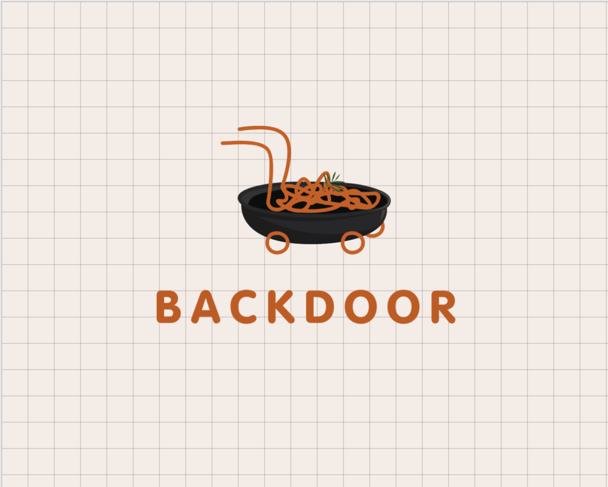

# BACKDOOR 
Microservices that is all you need for your personal food ordering and delivering application.




## PACKAGES FOR THE PROJECT

```bash
  npm install bcrypt @types/bcrypt
```
```bash
  npm install cors @types/cors
```
```bash
  npm install express @types/express
```
```bash
  npm install mongoose @types/mongoose
```
```bash
  npm install body-parser
```
```bash
  npm install jsonwebtoken @types/jsonwebtoken
```
```bash
  npm install multer @types/multer
```

## RUNNING THE PROJECT LOCALLY 
Git clone the project using the project HTTP / SSH link.

```bash
  git clone <link>
```
Use the 'll' terminal command to list the directories.
```bash
  ll
  ls -al
```
```bash
  cd backdoors/
```
Installing the dev-dependency packages for the project.
```bash
  npm install
```
Initiating the MongoDB Compass
```bash
  sudo systemctl status mongod
```
```bash
  sudo systemctl start mongod
```
Initiating the project server
```bash
  npm start
```

## PROJECT CONTRIBUTORS 

| AUTHOR               | PROFILE                                    |
|--------------------|------------------------------------------------|
| SUVAJIT KARMAKAR  | [LINK](https://github.com/SUVAJIT-KARMAKAR) |
| HRISHABH GAUTAM   | [LINK](https://github.com/hrishabh-16)       |
| MANOSWITA BOSE     | [LINK](https://github.com/manoswita2501)       |

## PROJECT TIMELINE 
- (5) 00:00:00


